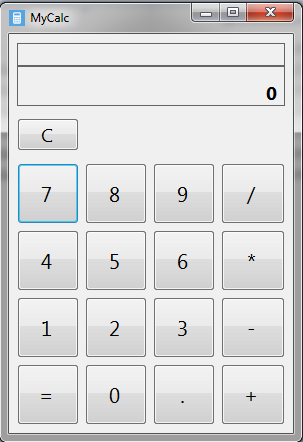
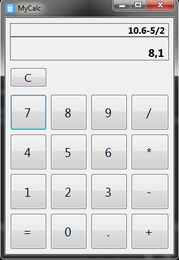
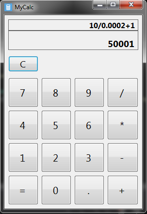

## This is simple calculator based on WinForms.
It can do arithmetic operations like adding, substracting, multiplaying and dividing.
For parsing and making manipulations with input string used Compute method of DataTable class.
#### Screenshots

